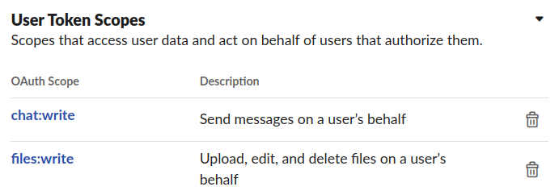
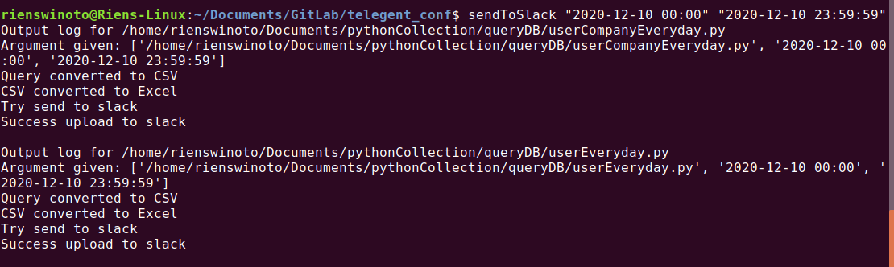

# QueryXcel Sender

Script that automate db query to csv and convert it to excel then send it to requester via slack

## Dependency (Library)
- psycopg2-binary (query to database by script)
- pandas (to convert query csv format to excel)
- openpyxl (excel driver for python to make excel format)
- slackclient (to communicate with slack API)
- hvac (to retrieve secret from Vault)

## Setup
- Create slack token that has right to send messages and upload file <br>

  
- Copy slack member ID, the person to interact. Go to their profile and click more to retrieve its ID <br>


- **Create .env variable for VAULT_ADDR and VAULT_TOKEN**
- Declare slack token in script or save it to Vault
- Change Vault mount point and path if necessary, this Vault will give db password and slack token
- For csv_locs and excel_locs adjust it with current machine directory

## How to use
- Execute python3 pyScript.py "star_dateValue" "end_dateValue"
- This script retrieve value from terminal, not from prompt to make it one shot automation
- To make it can run anywhere, need to declare it as alias command and declare its script location
- It script (shell) already clear declare its python script location and then set alias on .bashrc
that pointed to shell script.
```
    alias sendToSlack='bash /path/to/shellScript.sh'
```
- Everytime to use it just execute sendToSlack "start_dateValue" "end_dateValue"
- Shell script will pass the value to be consumed by python script <br>

